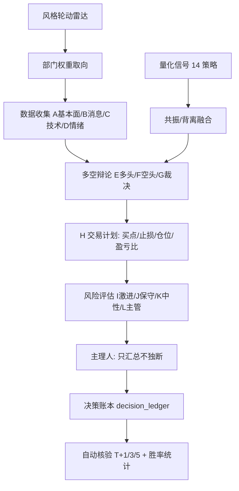

# A 股量化投研协作平台（Portfolio Project）

一个把「多角色投研流程 + 量化因子 + 回测验证」串起来的 A 股研究框架。
它模拟一支 12 个分析师角色的研究团队（基本面/消息/技术/情绪/多空辩论/交易/风险/主理人），
再用历史数据给每个环节的"拍板"做回测与因子权重学习，目标是短期收益与回撤控制之间的可验证平衡。

> 本项目仅用于研究与简历展示，不构成任何投资建议。

## 核心思路

1. **团队流程产品化**：每次决策都按 A(基本面)/B(消息)/C(技术)/D(情绪) → 多空辩论 →
   交易计划 → 风险评估 → 主理人汇总 的固定流水线执行，部门之间禁止直连。
2. **不让任何因子"平均说了算"**：用 862 只主板股票 × 2.7 年日线，逐截面算各因子对
   未来 5 日收益的 Spearman IC / ICIR，得到各部门自己的非等权因子权重。
3. **决策级回测**：把"团队自己的每次最终决定"记成账本（日期/标的/方向/价格/止损），
   收盘后自动核验 T+1/T+3/T+5，持续统计胜率。
4. **市场风格轮动雷达**：每日记录行业/概念涨幅与主力资金，归类到风格桶，判断风格
   "强化/切换/混沌"，再反向调整选股取向。

## 架构



## 关键研究结论（示例口径，非个股推荐）

| 实验 | 结果 |
|---|---|
| 因子权重学习 | 862 只主板 × 2.7 年；C 技术因子在 5 日口径偏低吸反转：近 10 日涨停/高 RSI/高换手/高位 → 未来 5 日平均跑输 |
| 等权 vs 学习权重 | 近半年 top 十分位平均 5 日收益：等权分 -0.55% → 学习权重 +0.48% |
| 止盈参数 | 崩盘反弹窗口：无止盈 -7.4%/胜率34% → +5%止盈 +11.4%/胜率60%、回撤 22.5%→6.4% |
| 决策账本 | 防守类（回避/卖出/空仓）5/5 正确；进攻类 BUY 曾 0/7 → 触发"BUY 稀有化"纪律 |

## 目录

```text
stock-research-platform/
├── docs/
│   ├── 组织架构.md          # 12 角色 + 主理人的职责与信息流
│   ├── 研究方法.md          # 因子学习 / 风格轮动 / 决策账本方法论
│   └── reports/            # 演示输出（运行后生成）
├── examples/
│   ├── factor_weights.json  # 学习后的部门因子权重示例
│   ├── style_snapshot.json  # 风格轮动快照示例
│   └── decision_ledger_sample.json  # 决策账本（脱敏示例）
├── src/
│   ├── astock_client.py     # 行情/资金/研报/公告等数据客户端
│   ├── factor_learning.py   # 因子权重学习（IC/ICIR）
│   ├── style_rotation.py    # 风格轮动雷达
│   ├── decision_backtest.py # 决策账本核验
│   └── prepare_demo_data.py # 下载演示行情
├── requirements.txt
├── LICENSE
└── README.md
```

## 运行示例

```bash
pip install -r requirements.txt

# 1) 下载 7 只主板股票的公开日线（baostock）
python3 src/prepare_demo_data.py

# 2) 因子权重学习（示例：样本较小，输出到 examples/factor_weights.json）
STOCK_DATA_DIR=data/hist python3 src/factor_learning.py

# 3) 决策账本核验（使用脱敏示例账本）
STOCK_DATA_DIR=data/hist python3 src/decision_backtest.py
```

说明：完整研究曾使用 862 只 × 2.7 年数据，运行方式相同；仓库只随附脱敏产物。

## 技术栈

Python 3.9 · pandas/numpy/scipy · baostock（历史日线）· 腾讯财经（实时行情）·
东方财富（涨停池/资金流/研报/公告）· 财联社（电报）· 妙想搜索（权威资讯）。

## 数据说明

本仓库不包含行情数据与个人交易记录。src/ 中的工具通过环境变量 `STOCK_DATA_DIR`
指向本地数据目录；scripts/prepare_demo_data.py 可下载一小批公开行情用于演示。

## 免责声明

所有输出均来自历史统计与公开数据，仅供研究方法演示；不构成投资建议。
